# C4 Component — ResumeForge

## Component Diagram

```mermaid
graph TB
    subgraph Pages["📄 Pages"]
        Home["Home Page<br/>(Landing + Templates)"]
        Editor["Editor Page<br/>(Split-Pane Editor)"]
    end
    
    subgraph Forms["📝 Form Components"]
        PersonalForm["PersonalForm"]
        ExperienceForm["ExperienceForm"]
        EducationForm["EducationForm"]
        SkillsForm["SkillsForm"]
        ProjectsForm["ProjectsForm"]
        CertsForm["CertificationsForm"]
    end
    
    subgraph Preview["👁️ Preview Components"]
        ResumePreview["ResumePreview<br/>(Template Router)"]
        ClassicT["ClassicTemplate"]
        ModernT["ModernTemplate"]
        ExecutiveT["ExecutiveTemplate"]
        CompactT["CompactTemplate"]
        MinimalT["MinimalTemplate"]
        TwoColT["TwoColumnTemplate"]
        CreativeT["CreativeTemplate"]
        DeveloperT["DeveloperTemplate"]
        AcademicT["AcademicTemplate"]
        EleganceT["EleganceTemplate"]
    end
    
    subgraph Tools["🔧 Tool Components"]
        ATSChecker["ATSScoreChecker<br/>(19 weighted checks)"]
        ATSSim["ATSSimulator<br/>(5 platform parsers)"]
        JDMatch["JobDescriptionMatcher<br/>(Keyword extraction)"]
        CoverLetter["CoverLetterGenerator<br/>(Template-based)"]
        DocxExport["DocxExport<br/>(Word generation)"]
        LinkedInImport["LinkedInImport<br/>(PDF parser)"]
        Profiles["ResumeProfiles<br/>(localStorage manager)"]
    end
    
    subgraph UX["✨ UX Components"]
        Onboarding["OnboardingTour"]
        Shortcuts["KeyboardShortcuts"]
        AutoSave["AutoSaveIndicator"]
        WordCount["WordCount"]
        SectionTips["SectionTips"]
        Completeness["ResumeCompleteness"]
        DragSections["DraggableSections"]
    end
    
    subgraph State["🗄️ State Management"]
        ResumeCtx["ResumeContext<br/>(Central State)"]
    end
    
    Editor --> Forms
    Editor --> Preview
    Editor --> Tools
    Editor --> UX
    Forms --> ResumeCtx
    Preview --> ResumeCtx
    Tools --> ResumeCtx
    UX --> ResumeCtx
    ResumePreview --> ClassicT & ModernT & ExecutiveT & CompactT & MinimalT & TwoColT & CreativeT & DeveloperT & AcademicT & EleganceT
    
    style Editor fill:#6750A4,color:#fff
    style ResumeCtx fill:#E8DEF8,color:#4A4458
```

## Components

### 1. Pages

| Component | File | Description |
|-----------|------|-------------|
| **Home** | `pages/Home.tsx` | Landing page with animated hero, feature cards, template grid (10 templates), FAQ accordion, smooth scroll nav, and mobile hamburger menu |
| **Editor** | `pages/Editor.tsx` | Split-pane resume editor with tabbed form panel (7 info tabs + 4 design tabs), live preview, recruiter preview mode, ATS simulation, and toolbar actions |

### 2. Form Components

| Component | File | Features |
|-----------|------|----------|
| **PersonalForm** | `forms/PersonalForm.tsx` | Name, title, email, phone, location, website, LinkedIn, summary |
| **ExperienceForm** | `forms/ExperienceForm.tsx` | Drag-and-drop reorder, duplicate, bullet point editor, date range |
| **EducationForm** | `forms/EducationForm.tsx` | Drag-and-drop reorder, duplicate, degree/institution/GPA |
| **SkillsForm** | `forms/SkillsForm.tsx` | Categorized skills with tag-based input |
| **ProjectsForm** | `forms/ProjectsForm.tsx` | Drag-and-drop reorder, duplicate, tech stack tags |
| **CertificationsForm** | `forms/CertificationsForm.tsx` | Drag-and-drop reorder, duplicate, issuer/date/ID |

### 3. Preview Components

| Component | File | Style |
|-----------|------|-------|
| **ResumePreview** | `preview/ResumePreview.tsx` | Template router — selects and renders the active template |
| **ClassicTemplate** | `preview/ResumePreview.tsx` | Traditional single-column, serif headings |
| **ModernTemplate** | `preview/ResumePreview.tsx` | Clean sans-serif, colored accent bar |
| **ExecutiveTemplate** | `preview/ResumePreview.tsx` | Dark header, gold accents, premium feel |
| **CompactTemplate** | `preview/ResumePreview.tsx` | Dense layout, maximizes content per page |
| **MinimalTemplate** | `preview/ResumePreview.tsx` | Whitespace-heavy, understated elegance |
| **TwoColumnTemplate** | `preview/ResumePreview.tsx` | Sidebar layout, skills on left |
| **CreativeTemplate** | `preview/NewTemplates.tsx` | Bold colors, geometric accents, portfolio-style |
| **DeveloperTemplate** | `preview/NewTemplates.tsx` | Monospace code aesthetic, terminal-inspired |
| **AcademicTemplate** | `preview/NewTemplates.tsx` | Formal serif, centered header, research-focused |
| **EleganceTemplate** | `preview/NewTemplates.tsx` | Refined typography, subtle gold accents |

### 4. Tool Components

| Component | File | Description |
|-----------|------|-------------|
| **ATSScoreChecker** | `ATSScoreChecker.tsx` | Runs 19 weighted checks across 4 categories (Contact, Content, Keywords, Formatting). Displays score, grade, and per-check pass/warn/fail with tips. |
| **ATSSimulator** | `ATSSimulator.tsx` | Simulates parsing by 5 ATS platforms (Workday, Greenhouse, Lever, Taleo, iCIMS). Shows platform-specific field labels, parse scores, and cross-platform comparison. |
| **JobDescriptionMatcher** | `JobDescriptionMatcher.tsx` | Extracts keywords from pasted job descriptions using regex + stop-word filtering. Shows match percentage, found/missing keyword pills, and quick tips. |
| **CoverLetterGenerator** | `CoverLetterGenerator.tsx` | Generates cover letters from resume data + optional job description. Supports 3 tones (Professional, Enthusiastic, Conversational). Inline editing, copy, download. |
| **DocxExport** | `DocxExport.tsx` | Generates Word documents using the `docx` library. Structures all resume sections with proper headings, bullet points, and formatting. |
| **LinkedInImport** | `LinkedInImport.tsx` | Parses text from LinkedIn PDF exports. Extracts name, headline, experience, education, and skills using pattern matching. |
| **ResumeProfiles** | `ResumeProfiles.tsx` | Manages multiple resume versions in localStorage. Create, rename, switch, delete, and duplicate profiles. |

### 5. UX Enhancement Components

| Component | File | Description |
|-----------|------|-------------|
| **OnboardingTour** | `OnboardingTour.tsx` | Step-by-step tooltip tour highlighting key features. Uses `data-tour` attributes to target elements. Shows once per user (localStorage flag). |
| **KeyboardShortcuts** | `KeyboardShortcuts.tsx` | Global keyboard handler + overlay modal (press "?"). Supports Ctrl+P (print), Ctrl+S (save JSON), Ctrl+E (toggle view), number keys for tabs. |
| **AutoSaveIndicator** | `AutoSaveIndicator.tsx` | Shows "Saved X ago" timestamp with manual save-to-JSON button. Updates every 30 seconds. |
| **WordCount** | `WordCount.tsx` | Real-time word count and estimated reading time across all resume sections. |
| **SectionTips** | `SectionTips.tsx` | Collapsible writing tips per form section. Context-aware advice (e.g., action verbs for Experience, quantification tips). |
| **ResumeCompleteness** | `ResumeCompleteness.tsx` | Circular progress ring showing completion percentage. Evaluates 10 fields. Tooltip shows missing items. |
| **DraggableSections** | `DraggableSections.tsx` | Drag-and-drop section reordering for the resume layout (Experience, Education, Skills, Projects, Certifications). |

### 6. State Management

| Component | File | Description |
|-----------|------|-------------|
| **ResumeContext** | `contexts/ResumeContext.tsx` | Central state management via React Context + useState. Provides all CRUD operations for resume sections, reorder/duplicate functions, template/color/font selection, and localStorage persistence with auto-save. |

## Inter-Component Dependencies

| Component | Depends On |
|-----------|-----------|
| Editor | ResumeContext, all Forms, ResumePreview, all Tools, all UX components |
| Home | ResumePreview (for template previews in lightbox) |
| All Forms | ResumeContext (read/write resume data) |
| ResumePreview | ResumeContext (read resume data, template selection) |
| ATSScoreChecker | ResumeContext (read resume data for analysis) |
| ATSSimulator | ResumeContext (read resume data for simulation) |
| JobDescriptionMatcher | ResumeContext (read resume data for keyword matching) |
| CoverLetterGenerator | ResumeContext (read resume data for letter assembly) |
| DocxExport | ResumeContext (read resume data for document generation) |
| ResumeProfiles | ResumeContext (read/write full resume state) |
| ResumeCompleteness | ResumeContext (read resume data for scoring) |
| WordCount | ResumeContext (read resume data for counting) |
