# C4 Container — ResumeForge

## Container Diagram

```mermaid
graph TB
    subgraph Browser["🌐 User's Browser"]
        direction TB
        SPA["📄 React SPA<br/>(Vite + React 19 + TypeScript)"]
        LS["💾 localStorage<br/>(Resume Data Store)"]
        
        subgraph UI["UI Layer"]
            Pages["Pages<br/>(Home, Editor)"]
            Components["Components<br/>(Forms, Preview, Modals)"]
            ShadcnUI["shadcn/ui<br/>(Component Library)"]
        end
        
        subgraph State["State Layer"]
            ResumeCtx["ResumeContext<br/>(React Context + useReducer)"]
            ThemeCtx["ThemeProvider<br/>(Dark/Light Mode)"]
        end
        
        subgraph Engine["Processing Engine"]
            Templates["Template Renderer<br/>(10 Resume Templates)"]
            ATS["ATS Analysis Engine<br/>(Score + Simulation)"]
            JDMatcher["Job Description Matcher<br/>(Keyword Extraction)"]
            CoverLetter["Cover Letter Generator<br/>(Template-Based)"]
            DocxExport["DOCX Export<br/>(docx library)"]
        end
        
        Pages --> Components
        Components --> ShadcnUI
        Pages --> ResumeCtx
        ResumeCtx <--> LS
        Components --> Templates
        Components --> ATS
        Components --> JDMatcher
        Components --> CoverLetter
        Components --> DocxExport
    end
    
    GF["🔤 Google Fonts CDN"]
    SPA -->|"Font requests"| GF
    
    style SPA fill:#6750A4,color:#fff
    style LS fill:#E8DEF8,color:#4A4458
    style GF fill:#F3EDF7,color:#1D1B20
```

## Containers

### 1. React Single-Page Application

| Property | Value |
|----------|-------|
| **Name** | ResumeForge SPA |
| **Type** | Web Application (Static) |
| **Technology** | React 19, TypeScript, Vite 6, Tailwind CSS 4 |
| **Deployment** | Static files served from CDN (Vercel, Netlify, or any static host) |
| **Build Output** | `dist/public/` — HTML, JS, CSS bundles |

**Purpose:** The entire application runs as a single-page application in the user's browser. It handles all user interactions, resume editing, template rendering, ATS analysis, and document export without any server-side processing.

### 2. Browser localStorage

| Property | Value |
|----------|-------|
| **Name** | Client Data Store |
| **Type** | Browser Storage |
| **Technology** | Web Storage API (localStorage) |
| **Capacity** | ~5MB per origin |

**Purpose:** Persists all resume data, user preferences (theme, font size), resume profiles, and onboarding state. Data is serialized as JSON strings. Each resume profile is stored under a unique key.

**Storage Keys:**

| Key | Description | Format |
|-----|-------------|--------|
| `resumeforge-data` | Current resume data | JSON (ResumeData type) |
| `resumeforge-profiles` | Saved resume profiles | JSON (ProfileData[]) |
| `resumeforge-theme` | Theme preference | `"light"` or `"dark"` |
| `resumeforge-tour-complete` | Onboarding state | `"true"` or absent |

## Technology Stack

| Layer | Technology | Version | Purpose |
|-------|-----------|---------|---------|
| Framework | React | 19 | UI rendering and component model |
| Language | TypeScript | 5.6+ | Type safety |
| Build Tool | Vite | 6 | Development server and production bundler |
| Styling | Tailwind CSS | 4 | Utility-first CSS framework |
| Components | shadcn/ui | Latest | Accessible, composable UI primitives |
| Animation | Framer Motion | 12 | Layout animations, transitions |
| DnD | @dnd-kit | 6 | Drag-and-drop reordering |
| Routing | Wouter | 3 | Client-side routing |
| DOCX | docx | 9 | Word document generation |
| Icons | Lucide React | Latest | Icon library |
| Toasts | Sonner | Latest | Toast notifications |
