# C4 Context — ResumeForge

## System Context Diagram

```mermaid
graph TB
    User["👤 Job Seeker<br/>(Resume Author)"]
    Recruiter["👤 Recruiter<br/>(Resume Reader)"]
    
    RF["📄 ResumeForge<br/>Browser-Based Resume Builder<br/>(React SPA)"]
    
    GF["🔤 Google Fonts CDN<br/>(External Service)"]
    LS["💾 Browser localStorage<br/>(Client Storage)"]
    
    User -->|"Creates, edits, and<br/>exports resumes"| RF
    Recruiter -->|"Views exported<br/>PDF/DOCX resumes"| RF
    RF -->|"Loads web fonts<br/>for templates"| GF
    RF <-->|"Persists resume data<br/>and user preferences"| LS
    
    style RF fill:#6750A4,color:#fff
    style User fill:#E8DEF8,color:#4A4458
    style Recruiter fill:#FFD8E4,color:#633B48
    style GF fill:#F3EDF7,color:#1D1B20
    style LS fill:#F3EDF7,color:#1D1B20
```

## Personas

| Persona | Description | Goals | Interactions |
|---------|-------------|-------|-------------|
| **Job Seeker** | Primary user who creates and manages resumes | Build an ATS-optimized, visually appealing resume quickly | Creates resume, selects templates, exports PDF/DOCX, uses ATS tools |
| **Recruiter** | Indirect user who receives exported resumes | Quickly scan and evaluate candidate qualifications | Views exported PDF/DOCX documents (no direct app interaction) |

## System Boundaries

ResumeForge is a **fully client-side application**. All processing happens in the user's browser. There is no backend server, no database, and no API calls to external services (except Google Fonts CDN for typography). Resume data never leaves the user's device unless they explicitly export it.

## External Dependencies

| System | Type | Purpose | Data Flow |
|--------|------|---------|-----------|
| Google Fonts CDN | External Service | Provides web fonts for resume templates | Outbound only (font file requests) |
| Browser localStorage | Client Storage | Persists resume data, profiles, preferences | Bidirectional (read/write) |
| Browser Print API | Browser API | Generates PDF exports via `window.print()` | Outbound only (triggers print dialog) |
| File System API | Browser API | Saves DOCX exports via file download | Outbound only (triggers download) |

## Key Quality Attributes

| Attribute | Priority | Implementation |
|-----------|----------|----------------|
| Privacy | Critical | Zero server communication — all data stays in browser |
| Performance | High | Vite-optimized build, code splitting, lazy loading |
| Accessibility | High | WCAG 2.1 AA compliance, keyboard navigation, screen reader support |
| Offline Capability | Medium | Works offline after initial load (fonts cached by browser) |
| Portability | Medium | Static files deployable to any CDN or static host |
